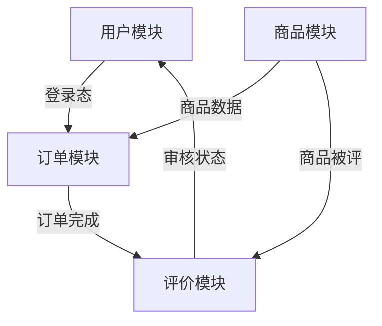

## 产品概述
在现有用户与订单系统的基础上，扩展商品管理及评价能力，构建完整的最小可行电商闭环，支持商品发布、浏览、选购与售后反馈。

## 业务架构
### 核心业务流程
1. 管理员/商家发布商品  
2. 用户注册/登录（已有）  
3. 浏览商品列表与详情  
4. 创建订单并关联商品（已有）  
5. 支付、取消或退款（已有）  
6. 对已购买商品进行评价  
7. 管理员查看/审核评价  

### 模块关系

- **用户模块**：已有 `register/login/logout/refresh`，提供身份认证。
- **订单模块**：已有 `Order` CRUD 及 `cancel/refund`，下单时需关联商品（通过 `productId`）。
- **商品模块**（新增）：负责商品创建、查询、列表，为订单提供商品信息。
- **评价模块**（新增）：用户对已购商品发表评价，管理员可查看与管理。

## 技术方案
### 技术选型理由
完全沿用现有技术栈，保证一致性及低耦合：
- **运行时**：Node.js + TypeScript，`tsx` 开发，生产编译为 JS。
- **框架**：Express 风格路由（基于现有 `src/routes/` 结构）。
- **校验**：`Zod` 定义输入输出 schema，确保类型安全。
- **日志**：`Pino` + `pino-pretty`。
- **代码规范**：`biomejs` 格式/ lint，`commitlint` + `husky` + `lint-staged` 保障提交质量。
- **持久化**：基于现有 `src/models/` 抽象（假设为内存或文件，保持简单），也可扩展为轻量数据库，但接口不变。
- **测试/调试**：`nodemon` 热重载。

### 关键设计决策
1. **商品与订单解耦**：订单仅存储 `productId` 快照，商品变更不影响历史订单，必要时可冗余关键字段（如价格、名称）至订单。
2. **评价关联关系**：评价必须绑定 userId 和 productId，且用户仅有已购买该商品时才允许评价（业务规则由订单状态校验）。
3. **API 设计规范**：遵循现有路由风格（RESTful），统一错误处理中间件，使用 Zod schema 校验请求体/查询参数。
4. **模块化组织**：新增 `src/models/product.model.ts`、`src/models/review.model.ts`；新增 `src/routes/products.ts`、`src/routes/reviews.ts`；新增对应 service 层以保持业务逻辑可测试。
5. **不重复已有功能**：所有新 API 均不与现有用户/订单端点冲突。

## 数据模型
### 核心实体
```typescript
// 商品
interface Product {
  id: string;
  name: string;
  description?: string;
  price: number;            // 单位：元
  stock: number;            // 库存
  category?: string;
  createdAt: Date;
  updatedAt: Date;
}

// 评价
interface Review {
  id: string;
  userId: string;           // 评价人
  productId: string;        // 评价商品
  orderId: string;          // 关联订单（可追溯）
  rating: number;           // 1-5
  comment?: string;
  status: 'pending' | 'approved' | 'rejected';
  createdAt: Date;
}
```

### 实体关系
- `User` (已有) 1 ── * `Order` (已有)  
- `Product` (新增) 1 ── * `Order`  
- `User` 1 ── * `Review`  
- `Product` 1 ── * `Review`  
- 一个订单项 (Order) 可能针对一个或多个商品，故可通过中间表或嵌入式数组实现，本次设计中订单仍保持关联单个商品，未来可扩展。

## API 设计映射（新增四个端点）
对应需求中给出的模糊 API 路径，具体化为：

| 方法 | 路径 | 功能 | 对应 FR |
|------|------|------|----------|
| GET | `/products` | 分页获取商品列表，支持筛选（分类、关键词） | FR-01 商品浏览 |
| POST | `/products` | 创建商品（管理员/商家） | FR-02 商品发布 |
| GET | `/products/:id` | 获取单个商品详情，含评价列表 | FR-03 商品详情 |
| POST | `/products/:id/reviews` | 对商品发表评价（需已购） | FR-04 发表评价 |

其余 FR-05（评价审核）与 FR-06（评价列表管理）可通过复用现有用户权限体系，在后续迭代中加入管理端点（例如 `PUT /admin/reviews/:id/approve` 等），当前设计已预留 `status` 字段。

## 实施要点
- 在 `src/models/` 下新增 `product.ts` 和 `review.ts`，定义 Zod schema 及 TypeScript 类型。
- 在 `src/services/` 下新增 `product.service.ts` 和 `review.service.ts`，实现核心逻辑。
- 在 `src/routes/` 下新增 `products.ts`（含评价子路由）并挂载至 Express app。
- 复用现有 `auth middleware` 保护需登录的端点（`POST /products` 和 `POST /products/:id/reviews`）。
- 编写单元测试以覆盖商品和评价业务规则。

此设计完全兼容现有代码风格与工具链，可直接在现有项目基础上增量开发。